# N-xport Data Tool — Technical Overview

This document explains how the N-xport data export and migration tool works under the hood: its architecture, how connections are established, the data collection and export pipeline, the migration system, and how the GUI and backend communicate.

---

## Table of Contents

- [Architecture Overview](#architecture-overview)
- [Connection & Session Lifecycle](#connection--session-lifecycle)
- [Authentication & Token Management](#authentication--token-management)
- [API Client & Rate Limiting](#api-client--rate-limiting)
- [Data Models](#data-models)
- [Export Execution Flow](#export-execution-flow)
- [Migration Execution Flow](#migration-execution-flow)
- [Export Formats & File Output](#export-formats--file-output)
- [GUI-Backend Communication (IPC)](#gui-backend-communication-ipc)
- [Profile & Credential Management](#profile--credential-management)
- [Error Handling & Resilience](#error-handling--resilience)
- [Security Considerations](#security-considerations)
- [Key Architectural Decisions](#key-architectural-decisions)

---

## Architecture Overview

The tool is composed of two layers: a React frontend rendered inside a Tauri desktop shell, and a Rust backend that handles all API communication, data processing, and file I/O.

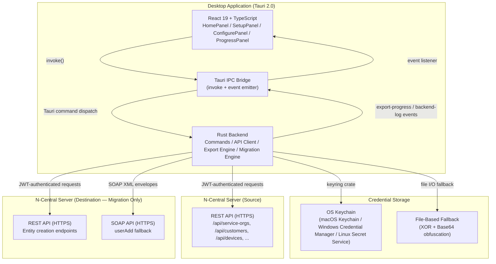

### Tech Stack

| Layer | Technology |
|-------|-----------|
| **Frontend** | React 19.1, TypeScript 5.8, Vite 7.0, CSS (dark theme) |
| **Desktop Shell** | Tauri 2.0 (Rust), tauri-plugin-dialog, tauri-plugin-fs, tauri-plugin-opener, tauri-plugin-updater, tauri-plugin-process |
| **Backend** | Rust (Edition 2021), Tokio async runtime, Reqwest (rustls TLS), Serde |
| **Data Export** | csv crate (RFC 4180), serde_json (pretty-printed) |
| **Credentials** | keyring crate (OS keychain), Base64 + XOR file fallback |
| **CLI** | Clap 4.x (derive macros) |
| **Logging** | tracing + tracing-subscriber |
| **Target** | N-able N-Central REST API v1 (with SOAP fallback for user creation) |

---

## Connection & Session Lifecycle

Every export or migration begins with establishing an authenticated connection to at least one N-Central server. The connection flow validates credentials and retrieves server metadata before any data operations begin.

### Single-Server Connection (Export Mode)

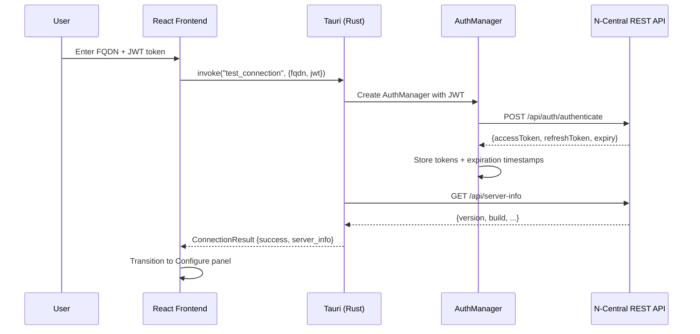

### Dual-Server Connection (Migration Mode)

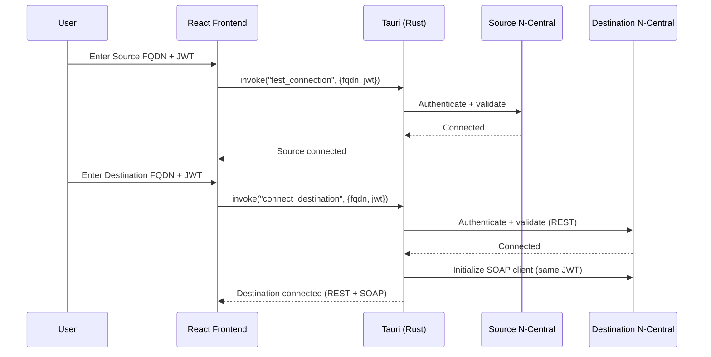

**Key details:**

- **JWT authentication**: The user provides a pre-generated JWT API token from their N-Central instance. This token is exchanged for a short-lived access token and a refresh token via the `/api/auth/authenticate` endpoint.

- **Connection validation**: After authentication, the tool fetches `/api/server-info` to verify the server is reachable and running a compatible N-Central version.

- **Dual-client state**: In migration mode, the `AppState` struct holds both a source `NcClient` and a destination `NcClient` (plus an `NcSoapClient` for SOAP fallback), each with independent authentication.

---

## Authentication & Token Management

The `AuthManager` (`src-tauri/src/api/auth.rs`) handles the full JWT token lifecycle with automatic refresh.

### Token Storage

```rust
pub struct AuthManager {
    base_url: String,
    client: reqwest::Client,
    auth_state: Arc<RwLock<AuthState>>,  // Thread-safe interior mutability
}

struct AuthState {
    access_token: String,
    refresh_token: String,
    access_token_expires_at: DateTime<Utc>,
    refresh_token_expires_at: DateTime<Utc>,
}
```

### Token Refresh Flow

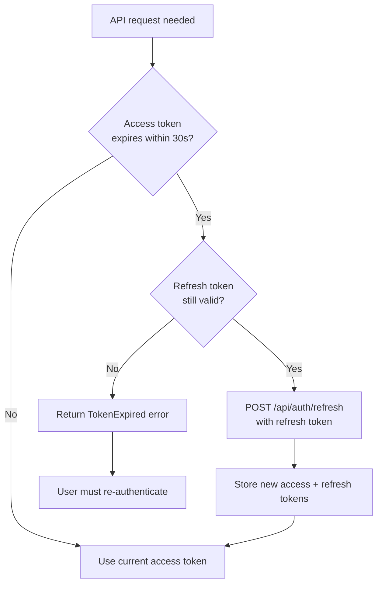

**Key details:**

- **30-second buffer**: Token refresh is triggered 30 seconds before the access token actually expires, preventing mid-request expiration.
- **Thread safety**: `Arc<RwLock<AuthState>>` allows concurrent reads (for normal API calls) with exclusive writes (during token refresh).
- **401/403 handling**: If an API call returns 401 or 403, the client attempts one token refresh before failing. This handles race conditions where the token expired between the check and the request.

---

## API Client & Rate Limiting

### NcClient Architecture

The `NcClient` (`src-tauri/src/api/client.rs`) is the central HTTP client for all N-Central REST API interactions.

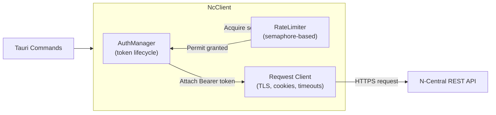

### Request Pipeline

Every API call follows this pipeline:

1. **Rate limit acquisition**: Acquire a semaphore permit for the endpoint category (blocks if at capacity)
2. **Token validation**: Check if the access token needs refresh; refresh if necessary
3. **Request construction**: Build the request with Bearer token, JSON content type, and any query parameters
4. **Response handling**: Parse the response, handling pagination if the endpoint returns paginated data
5. **Error recovery**: On 429 (rate limited) or 5xx (server error), retry with exponential backoff
6. **Semaphore release**: Release the rate limit permit (automatic via RAII)

### Rate Limiter

The `RateLimiter` (`src-tauri/src/api/rate_limiter.rs`) uses Tokio semaphores to enforce per-endpoint concurrency limits:

| Endpoint Category | Concurrent Limit | Examples |
|-------------------|-----------------|----------|
| **Authentication** | 50 | `/api/auth/authenticate`, `/api/auth/refresh` |
| **List (paginated)** | 5 | `/api/customers`, `/api/devices`, `/api/users` |
| **Single resource** | 50 | `/api/devices/{id}`, `/api/customers/{id}` |
| **Properties** | 5 | `/api/org-units/{id}/custom-properties` |

**Path normalization**: Parameterized routes (e.g., `/api/devices/12345/assets`) are normalized to `/api/devices/{id}/assets` before matching, so all requests to the same endpoint type share a single concurrency pool.

### Retry Strategy

| Error Type | Retry Behavior |
|-----------|---------------|
| **429 (Rate Limited)** | Wait per `Retry-After` header, up to 3 retries |
| **5xx (Server Error)** | Exponential backoff: 1s, 2s, 4s, 8s, 16s max — up to 3 retries |
| **401/403 (Auth)** | Refresh token once, then fail |
| **Timeout** | 60-second per-request timeout, no automatic retry |

### Pagination

All list endpoints return paginated responses. The client automatically iterates all pages:

```
Page 1: GET /api/customers?pageNumber=1&pageSize=100
Page 2: GET /api/customers?pageNumber=2&pageSize=100
...
Page N: GET /api/customers?pageNumber=N&pageSize=100
```

The `PaginatedResponse<T>` wrapper extracts `PageInfo` (total pages, total items) from each response and continues fetching until all pages are collected.

---

## Data Models

All data models are defined in `src-tauri/src/models/` and use Serde for serialization and deserialization. The models map to the N-Central REST API response structures.

### Organization Hierarchy

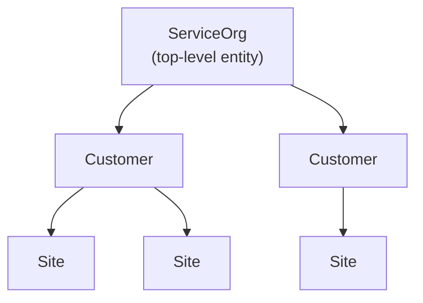

| Model | Key Fields | API Source |
|-------|-----------|-----------|
| `ServiceOrg` | id, name, parent_id | `/api/service-orgs` |
| `Customer` | id, name, parent_id, service_org_id | `/api/customers` |
| `Site` | id, name, parent_id, customer_id | `/api/sites` (under customers) |

### Device & Asset Models

| Model | Key Fields | API Source |
|-------|-----------|-----------|
| `Device` | id, name, org_unit_id, device_class, os_name | `/api/devices` |
| `DeviceAsset` | computer_system, bios, processor, memory, disk_drives | `/api/devices/{id}/assets` |
| `DeviceProperty` | property_id, label, value | `/api/devices/{id}/custom-properties` |

**DeviceAsset sub-types**: `ComputerSystem`, `BiosInfo`, `ProcessorInfo`, `MemoryInfo`, `DiskDriveInfo`, `NetworkAdapterInfo` — each representing a category of hardware telemetry.

### User & Access Models

| Model | Key Fields | API Source |
|-------|-----------|-----------|
| `User` | id, email, username, role_ids, access_group_ids, is_enabled | `/api/users` |
| `UserRole` | id, name, permission_names, role_type | `/api/user-roles` |
| `AccessGroup` | id, name, member_usernames, org_unit_ids | `/api/access-groups` |

### Custom Properties

| Model | Key Fields | API Source |
|-------|-----------|-----------|
| `OrgProperty` | property_id, label, value, org_unit_id | `/api/org-units/{id}/custom-properties` |

### Serialization Helpers

The `common.rs` module provides custom serialization functions for handling API inconsistencies:

| Helper | Purpose |
|--------|---------|
| `string_or_i64()` | Deserialize fields that may be returned as either string or integer |
| `option_string_or_i64()` | Optional variant of above |
| `serialize_vec_to_string()` | Serialize `Vec<T>` as semicolon-separated string for CSV export |
| `serialize_opt_vec_to_string()` | Optional variant of above |

---

## Export Execution Flow

The export system is the core functionality of N-xport. It fetches data from a source N-Central server and writes it to CSV and/or JSON files.

### End-to-End Flow

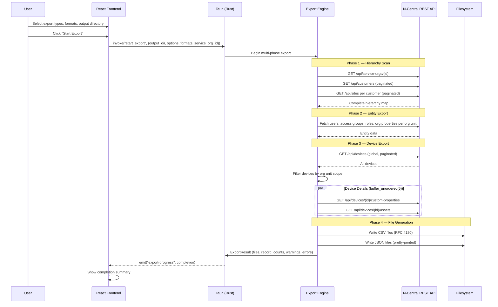

### Multi-Phase Export Pipeline

The export runs in four phases, each emitting progress events to the UI:

**Phase 1 — Hierarchy Scan (0-10%)**

Builds the complete organizational tree starting from the specified Service Organization ID:

1. Fetch the Service Organization details
2. Fetch all Customers under the SO (paginated)
3. For each Customer, fetch all Sites (paginated)
4. Build a flat list of all org unit IDs for scoping subsequent queries

**Phase 2 — Entity Export (10-60%)**

For each org unit in the hierarchy, fetch:

- **Users**: Deduplicated by user ID (users can appear under multiple org units)
- **Access Groups**: With member usernames and org unit scope
- **User Roles**: With permission name mappings
- **Organization Properties**: Custom property key-value pairs

Each entity type is fetched iteratively across all org units, with caching to avoid duplicate API calls.

**Phase 3 — Device Export (60-90%)**

1. Fetch all devices globally (paginated)
2. Filter to devices within the scoped org units
3. For each in-scope device (concurrently, up to 5 at a time via `buffer_unordered(5)`):
   - Fetch custom properties (if selected)
   - Fetch hardware assets (if selected)

**Phase 4 — File Generation (90-100%)**

Write all collected data to the selected export formats (CSV, JSON, or both) in the specified output directory.

### Cancellation

The `AppState` contains an `AtomicBool` cancel token. When the user clicks "Cancel Export":

1. The frontend calls `invoke("cancel_export")`
2. The Rust backend sets `cancel_token` to `true`
3. The export loop checks `cancel_token` at each phase boundary and between API calls
4. On cancellation, a partial export result is returned with a cancellation flag

---

## Migration Execution Flow

The migration system transfers configuration data from a source N-Central server to a destination server. It creates entities on the destination while maintaining ID mappings for cross-references.

### Migration Architecture

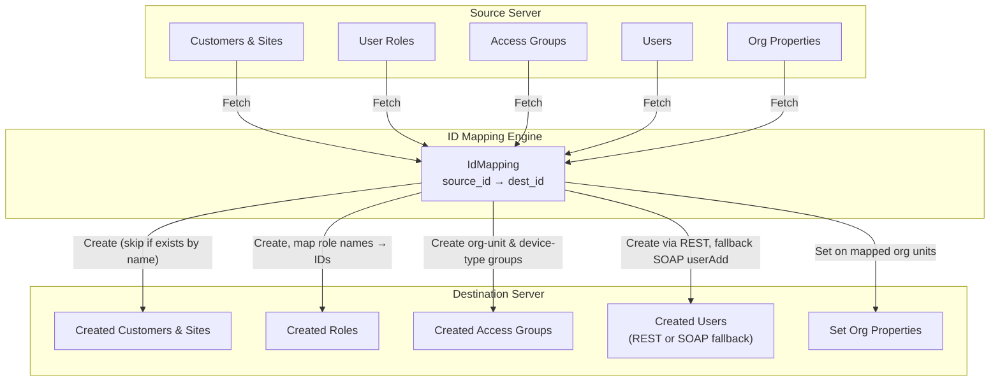

### ID Mapping Structure

The `IdMapping` struct tracks all source-to-destination ID translations:

```
IdMapping {
    customer_ids:    HashMap<i64, i64>,     // source customer ID → dest customer ID
    site_ids:        HashMap<i64, i64>,     // source site ID → dest site ID
    role_ids:        HashMap<i64, i64>,     // source role ID → dest role ID
    access_group_ids: HashMap<i64, i64>,    // source AG ID → dest AG ID
    role_name_lookup: HashMap<String, i64>, // role name → dest role ID
    user_login_lookup: HashMap<String, i64>,// username → dest user ID
    org_unit_ids:    HashMap<i64, i64>,     // source org unit → dest org unit
    access_group_members: HashMap<i64, Vec<String>>, // AG ID → member usernames
}
```

### Migration Steps

| Step | Entity | Method | Deduplication |
|------|--------|--------|---------------|
| 1 | **Customers & Sites** | REST POST, concurrent (buffer_unordered(2)) | Skip if name already exists on destination |
| 2 | **User Roles** | REST POST | Build role name → ID mapping |
| 3 | **Access Groups** | REST POST (org-unit + device-type groups) | Skip if name already exists |
| 4 | **Users** | REST POST, fallback to SOAP `userAdd` | Map roles & access groups via ID mappings |
| 5 | **Org Properties** | REST PUT on mapped org units | Set values on destination org units |

### SOAP Fallback for User Creation

The REST API may not support all user creation scenarios. When REST fails, the migration falls back to SOAP:

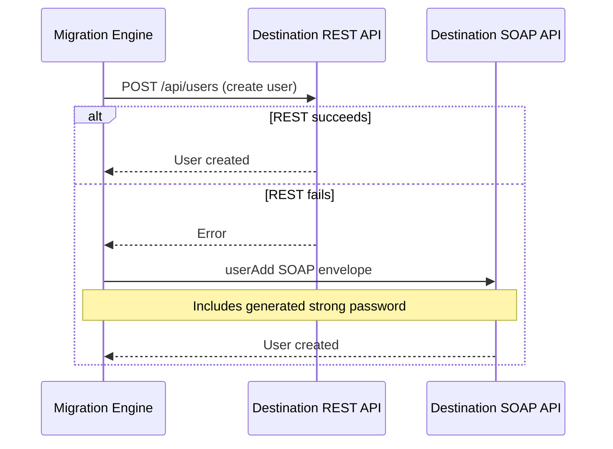

**SOAP client details** (`src-tauri/src/api/soap_client.rs`):

- Uses XML-based SOAP 1.2 envelopes
- JWT authentication via the same token as REST
- 120-second timeout (longer than REST to accommodate SOAP processing)
- Strong password generation for new users (random, meets N-Central complexity requirements)

---

## Export Formats & File Output

### CSV Export

- **Standard**: RFC 4180 compliant via the `csv` crate
- **Encoding**: UTF-8
- **Array fields**: Serialized as semicolon-separated strings (e.g., `role1;role2;role3`)
- **Headers**: Derived from struct field names (snake_case)
- **Directory**: Created automatically if it doesn't exist

### JSON Export

- **Format**: Pretty-printed by default (indented), with compact option available
- **Structure**: Array of objects, one per record
- **Nested objects**: Complex types (e.g., DeviceAsset sub-types) are preserved as nested JSON
- **Field names**: Match the original API response field names

### Output Files

| Export Type | Filename | Content |
|-------------|----------|---------|
| Service Organizations | `service_orgs.csv/json` | SO hierarchy details |
| Customers | `customers.csv/json` | All customers under the SO |
| Sites | `sites.csv/json` | All sites under customers |
| Devices | `devices.csv/json` | Device inventory with classification |
| Users | `users.csv/json` | User accounts, roles, access groups |
| Access Groups | `access_groups.csv/json` | Group definitions and membership |
| User Roles | `user_roles.csv/json` | Role definitions and permissions |
| Org Properties | `org_properties.csv/json` | Custom property key-value pairs |
| Device Properties | `device_properties.csv/json` | Per-device custom properties |
| Device Assets | `device_assets.csv/json` | Hardware details (CPU, RAM, disk, etc.) |

---

## GUI-Backend Communication (IPC)

The desktop GUI uses Tauri's built-in IPC mechanism: the React frontend invokes Rust commands, and the Rust backend emits events back to the frontend.

### IPC Architecture

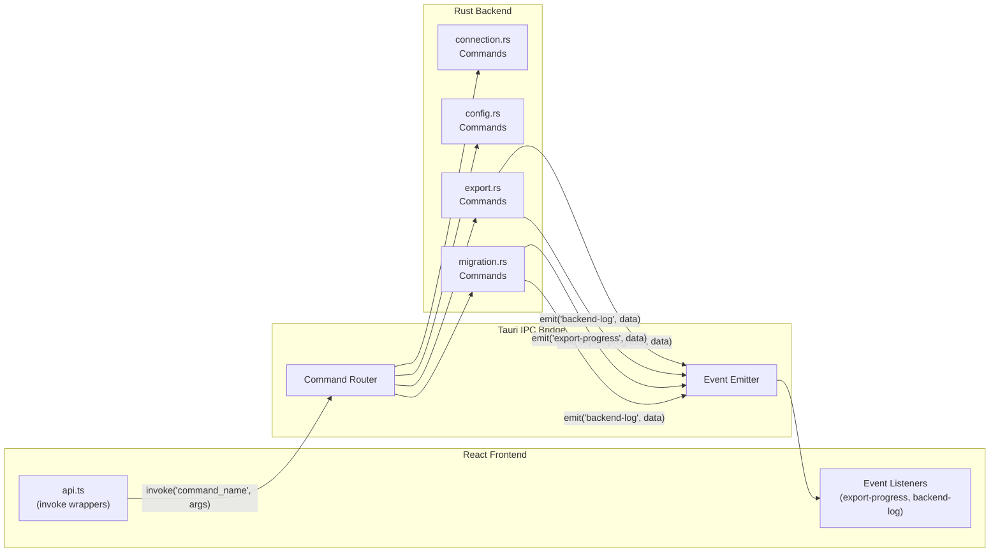

### Progress Events

During export and migration, the backend emits real-time progress updates:

**ProgressUpdate structure**:

```json
{
  "phase": "Exporting devices",
  "message": "Fetching device properties",
  "percent": 65,
  "current": 42,
  "total": 108
}
```

**LogMessage structure**:

```json
{
  "level": "info",
  "message": "Exported 108 devices to CSV"
}
```

Log levels: `info`, `success`, `warning`, `error`, `debug`

### Tauri Commands

The full set of commands exposed by the Rust backend:

| Category | Command | Purpose |
|----------|---------|---------|
| **Connection** | `test_connection(fqdn, jwt, username?)` | Validate server connection |
| | `connect_with_profile(profile_name, fqdn, username?)` | Connect using saved credentials |
| | `connect_destination(fqdn, jwt, username?)` | Setup destination server (migration) |
| | `disconnect()` | Clear client state |
| | `get_service_org_info(service_org_id)` | Fetch SO details |
| **Credentials** | `save_credentials(profile_name, jwt, password?)` | Store to keyring |
| | `has_credentials(profile_name)` | Check if stored |
| | `get_credentials(profile_name)` | Retrieve JWT |
| | `get_password(profile_name)` | Retrieve optional password |
| | `delete_credentials(profile_name)` | Remove all |
| **Config** | `get_settings()` | Load settings.json |
| | `save_settings(settings)` | Write settings.json |
| | `get_profiles()` / `save_profile()` / `delete_profile()` | Profile CRUD |
| | `set_active_profile(name)` / `get_active_profile()` | Active profile |
| **Export** | `start_export(output_dir, options, formats, service_org_id)` | Begin export |
| | `get_export_types()` | List available data types |
| | `cancel_export()` | Stop running export |
| | `open_directory(path)` | Open export folder in OS file manager |
| **Migration** | `start_migration(options, source_so_id, dest_so_id)` | Begin migration |

### AppState (Shared Mutable State)

```rust
pub struct AppState {
    pub client: Arc<Mutex<Option<NcClient>>>,              // Source REST client
    pub dest_client: Arc<Mutex<Option<NcClient>>>,         // Destination REST client
    pub dest_soap_client: Arc<Mutex<Option<NcSoapClient>>>,// Destination SOAP fallback
    pub cancel_token: Arc<AtomicBool>,                     // Cancellation flag
}
```

All fields use `Arc<Mutex<>>` for thread-safe access from multiple async Tauri command handlers. The `cancel_token` uses `AtomicBool` for lock-free cancellation signaling.

---

## Profile & Credential Management

### Saved Profiles

Connection profiles store reusable server configurations. Each profile contains:

```
Profile {
    name: String,           // Display name (e.g., "Production", "Staging")
    profile_type: String,   // "export" or "migration"
    source: ConnectionConfig {
        fqdn: String,
        username: Option<String>,
        service_org_id: Option<i64>,
    },
    destination: Option<ConnectionConfig>,  // Only for migration profiles
    last_used: Option<DateTime>,
}
```

### Application Settings

Settings are persisted as JSON in the platform-specific config directory (via the `directories` crate):

| Platform | Path |
|----------|------|
| **macOS** | `~/Library/Application Support/com.fraziersystems.nc-data-export/settings.json` |
| **Windows** | `%APPDATA%\com.fraziersystems.nc-data-export\settings.json` |
| **Linux** | `~/.config/com.fraziersystems.nc-data-export/settings.json` |

Settings include: profiles list, active profile, export directory, export formats, and window state (size, position, maximized).

### Credential Storage

Credentials are managed by the `CredentialManager` (`src-tauri/src/credentials/keyring.rs`) with a two-tier storage strategy:

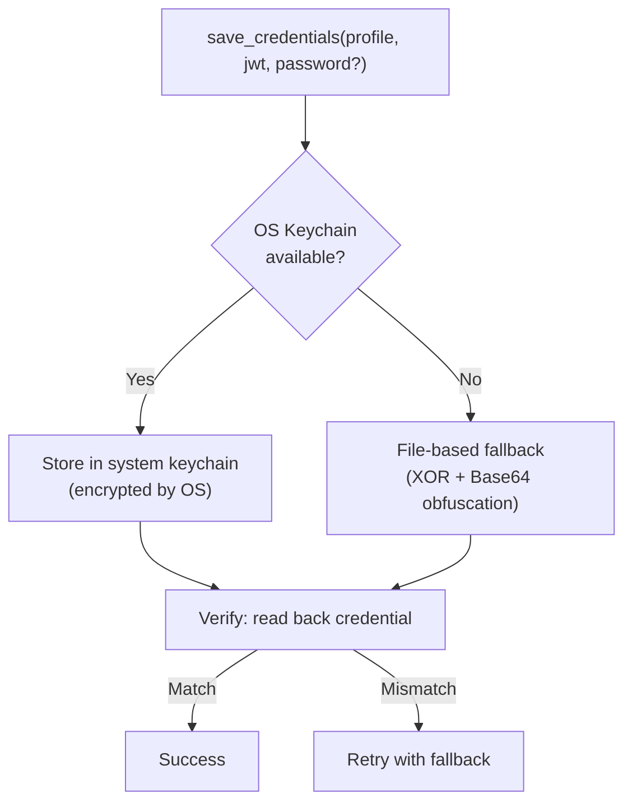

**Primary — OS System Keychain**:

| Platform | Backend |
|----------|---------|
| macOS | Keychain Services |
| Windows | Credential Manager |
| Linux | Secret Service (GNOME Keyring, KWallet) |

**Fallback — File-Based Storage**: If the OS keychain is unavailable or fails, credentials are stored in a local file using XOR obfuscation with Base64 encoding. This is not cryptographically secure but prevents casual inspection.

**Storage keys**:
- JWT token: stored under key `{profile_name}`
- Password (optional): stored under key `{profile_name}_password`

**Verification**: After storing a credential, the manager reads it back to confirm it persisted correctly. This handles edge cases with keychain timing or permission issues.

---

## Error Handling & Resilience

### Error Type Hierarchy

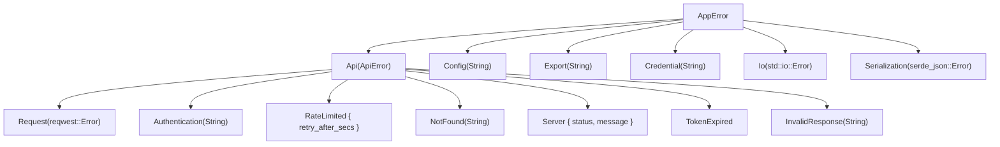

Both `AppError` and `ApiError` implement `Display` and serialize as strings for Tauri IPC transport. The `thiserror` crate provides ergonomic error type definitions.

### Export Error Resilience

The export pipeline is designed to produce partial results rather than fail completely:

- **Per-entity errors**: If fetching a specific device's properties fails, the error is logged as a warning and the export continues with the remaining devices
- **Per-type errors**: If an entire entity type fails (e.g., all user fetches error), the warning is recorded and other entity types continue
- **Warnings collection**: All non-fatal errors are collected into a warnings list and returned in the `ExportResult`
- **Final report**: The completion summary shows total records exported, files created, and any warnings/errors encountered

---

## Security Considerations

### TLS / HTTPS

- All API communication uses HTTPS with a minimum of TLS 1.2
- The Reqwest client is configured with `rustls` (a pure-Rust TLS implementation) — no OpenSSL dependency
- The Tauri CSP policy allows `connect-src 'self' https://*` — only HTTPS connections are permitted

### Credential Handling

- **JWT tokens**: Stored in OS keychain (encrypted by the OS) with file-based fallback
- **Tokens in memory**: Held in `Arc<RwLock<>>` for the duration of the session, cleared on disconnect
- **No logging of secrets**: JWT tokens and passwords are never written to logs
- **Credential verification**: Post-storage verification ensures credentials were actually persisted

### Token Expiration

- Access tokens are short-lived and automatically refreshed 30 seconds before expiry
- Refresh token expiration is tracked — if the refresh token expires, the user must re-authenticate
- The `AuthManager` prevents stale tokens from being used in API requests

### Rate Limiting

- Per-endpoint semaphore-based concurrency control prevents overwhelming the N-Central API
- 429 responses are handled gracefully with `Retry-After` header compliance
- Exponential backoff on server errors prevents retry storms

### Input Handling

- All API responses are deserialized through strongly-typed Serde models — no raw string interpolation
- File paths for export are validated and parent directories are created safely
- The Tauri security model restricts frontend access to only the registered command set

---

## Key Architectural Decisions

### Tauri over Electron

The tool uses **Tauri 2.0** instead of Electron for the desktop shell. This provides:

- Significantly smaller binary size (Tauri apps are typically 5-10MB vs 100MB+ for Electron)
- Lower memory footprint (no bundled Chromium)
- Native OS integration (system keychain, file dialogs, auto-updater)
- Rust backend for performance-critical operations (API calls, data processing, file I/O)

### Rust Backend for API Communication

All N-Central API communication happens in Rust rather than in the frontend. This provides:

- **Connection pooling**: Reqwest maintains persistent connections
- **Concurrent rate limiting**: Tokio semaphores enable precise concurrency control
- **Token management**: Thread-safe token refresh without frontend involvement
- **File I/O**: Direct filesystem access without browser sandbox limitations

### REST-First with SOAP Fallback

The N-Central REST API is the primary integration point. SOAP is used only for `userAdd` during migration, because the REST API may not support all user creation scenarios. This dual-protocol approach maximizes compatibility while preferring the simpler REST interface.

### Concurrent Device Detail Fetching

Device properties and assets are fetched per-device (the API doesn't support bulk fetching). To keep this performant, the export uses `buffer_unordered(5)` — up to 5 device detail requests run concurrently. This balances throughput against API rate limits.

### Name-Based Deduplication for Migration

During migration, entities are deduplicated by **name** rather than ID. If a customer or access group with the same name already exists on the destination, it is skipped rather than duplicated. This makes migrations idempotent — running the same migration twice produces the same result.

### No Session Persistence

Export and migration state is not persisted between sessions. If the application is closed mid-operation, progress is lost and the operation must be restarted. This simplifies the architecture by avoiding checkpoint/resume logic, and is acceptable because most exports complete within a few minutes.

### Auto-Update Distribution

The application uses Tauri's built-in updater plugin with GitHub Releases as the update source. When a new version is published:

1. The app checks for updates on launch (via `useUpdateChecker`)
2. If an update is available, a banner is displayed
3. The user can choose to install the update
4. The updater downloads the platform-specific installer and applies it

**Distribution targets**:

| Platform | Format |
|----------|--------|
| macOS | `.dmg` (Intel + Apple Silicon universal) |
| Windows | `.msi` installer |
| Linux | `.deb` (Debian/Ubuntu) or `.AppImage` (universal) |

---

## Frontend Component Architecture

### React Component Tree

```
App.tsx (state management, event listeners, workflow orchestration)
├── HomePanel.tsx        — Welcome screen, mode selection (export / migrate)
├── SetupPanel.tsx       — Server connection form, credential entry, profile selection
├── ConfigurePanel.tsx   — Export type checkboxes, format selection, output directory
├── ProgressPanel.tsx    — Real-time progress bar, activity log, cancel button
├── NewProfileModal.tsx  — Profile creation dialog
└── UpdateBanner         — Auto-update notification (via useUpdateChecker)
```

### Workflow State Machine

```
    ┌──────────┐   mode selected   ┌───────────┐   connected    ┌─────────────┐
    │   HOME   │ ───────────────── │   SETUP   │ ────────────── │  CONFIGURE  │
    └──────────┘                   └───────────┘                └─────────────┘
                                                                       │
                                                                  start export
                                                                       │
    ┌──────────┐   view results    ┌─────────────┐   running    ┌─────────────┐
    │ COMPLETE │ ◄──────────────── │  EXPORTING  │ ◄──────────── │  CONFIGURE  │
    └──────────┘                   └─────────────┘              └─────────────┘
         │                                │
         │         cancel / error         │
         └────────────────────────────────┘
```

### Type Definitions

The frontend type system (`src/types.ts`) mirrors the Rust backend structures:

| Type | Purpose |
|------|---------|
| `Profile` | Saved connection profile |
| `ConnectionConfig` | Server FQDN + credentials |
| `Settings` | Application preferences |
| `ExportOptions` | Selected data types for export |
| `ExportResult` | Export completion summary |
| `ProgressUpdate` | Real-time progress event |
| `LogEntry` | Activity log message |
| `ExportType` | Available export data types |
| `ConnectionStatus` | Connection state enum |

### API Wrapper

`src/api.ts` provides thin, type-safe wrappers around Tauri's `invoke()` function. Each wrapper maps to a single Tauri command:

```typescript
// Example: type-safe command invocation
export async function startExport(
    outputDir: string,
    options: ExportOptions,
    formats: string[],
    serviceOrgId: number
): Promise<ExportResult> {
    return invoke("start_export", { outputDir, options, formats, serviceOrgId });
}
```

---

## Key Source Files

| File | Purpose |
|------|---------|
| `src-tauri/src/lib.rs` | Tauri app initialization, plugin registration, command handler registration |
| `src-tauri/src/main.rs` | Platform entry point (Windows subsystem config) |
| `src-tauri/src/api/client.rs` | `NcClient` — async REST API client with pagination & retry |
| `src-tauri/src/api/auth.rs` | `AuthManager` — JWT token lifecycle & automatic refresh |
| `src-tauri/src/api/endpoints.rs` | API path constants & endpoint builders |
| `src-tauri/src/api/rate_limiter.rs` | Semaphore-based per-endpoint concurrency control |
| `src-tauri/src/api/soap_client.rs` | `NcSoapClient` — SOAP fallback for user creation |
| `src-tauri/src/models/*.rs` | Serde data models (ServiceOrg, Customer, Device, User, etc.) |
| `src-tauri/src/models/common.rs` | Serialization helpers for API inconsistencies |
| `src-tauri/src/commands/connection.rs` | Connection & credential Tauri commands, `AppState` definition |
| `src-tauri/src/commands/config.rs` | Settings & profile Tauri commands |
| `src-tauri/src/commands/export.rs` | Multi-phase export orchestration logic |
| `src-tauri/src/commands/migration.rs` | Multi-step migration with ID mapping |
| `src-tauri/src/export/csv.rs` | CSV file writer (RFC 4180) |
| `src-tauri/src/export/json.rs` | JSON file writer (pretty-printed) |
| `src-tauri/src/config/settings.rs` | Settings persistence & profile management |
| `src-tauri/src/credentials/keyring.rs` | OS keychain + file fallback credential storage |
| `src-tauri/src/error.rs` | `AppError` & `ApiError` type definitions |
| `src/App.tsx` | React main component — state management & workflow orchestration |
| `src/api.ts` | Type-safe Tauri command wrappers |
| `src/types.ts` | TypeScript interface definitions |
| `src/components/HomePanel.tsx` | Welcome screen & mode selection |
| `src/components/SetupPanel.tsx` | Connection form & profile management |
| `src/components/ConfigurePanel.tsx` | Export configuration UI |
| `src/components/ProgressPanel.tsx` | Real-time progress display |
| `src-tauri/Cargo.toml` | Rust dependencies |
| `src-tauri/tauri.conf.json` | Tauri app configuration (window, CSP, updater, bundler) |
| `package.json` | Node.js dependencies & build scripts |
| `vite.config.ts` | Vite build configuration (React plugin, Tauri dev host) |
